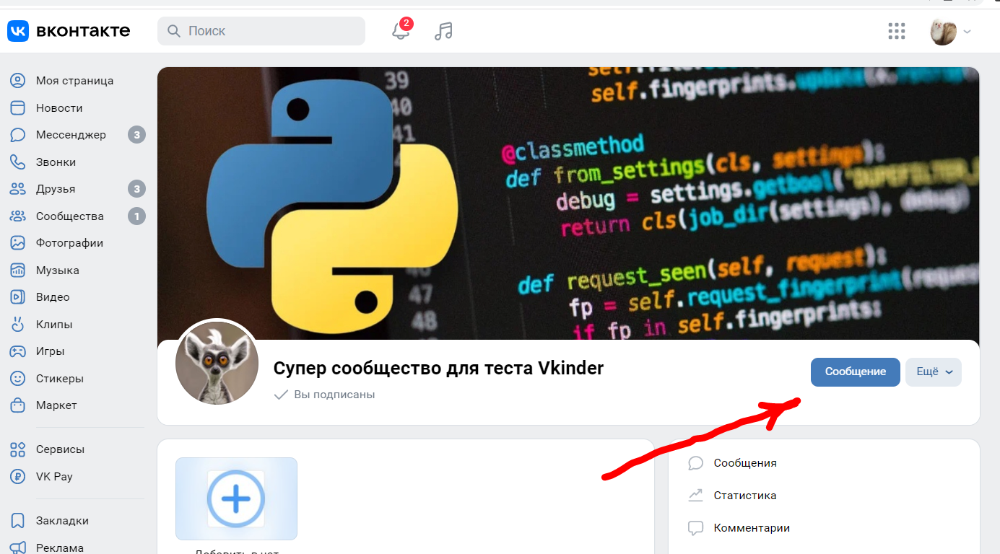
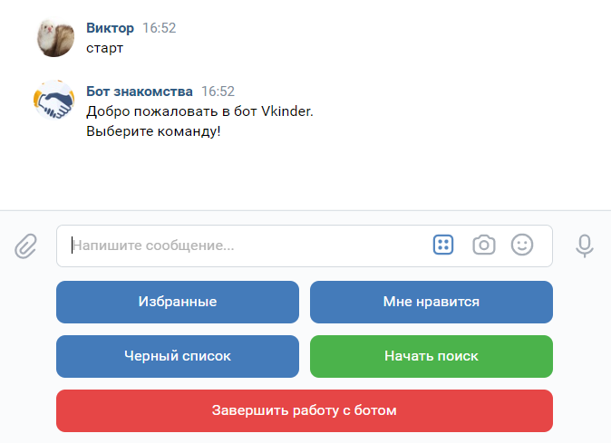
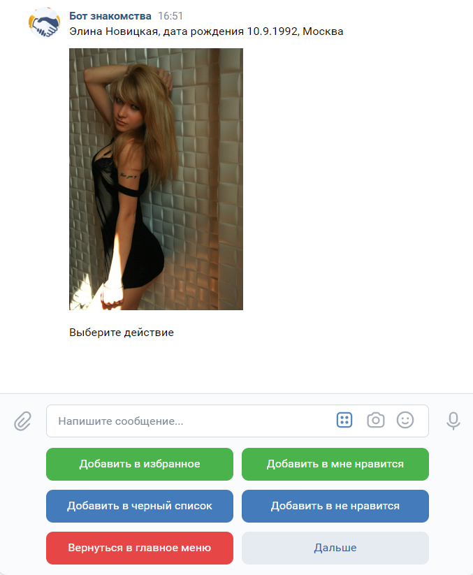

# Командный проект по курсу «Профессиональная работа с Python»
## Описание
Проект представляет собой программу-бота в ВКонтакте, которая предоставляет сервис знакомств.  
Кандидатуры для знакомства подбираются так же из пользователей ВК со статусом "В активном поиске".  
Реализовано взаимодействие с **API ВКонтакте**, по мере работы с посетителями информация сохраняется в БД **Postgress**.  

Реализована возможность поиска кандидатур для знакомства по полу, возрасту, городу проживания.
Так же реализовано добавление понравившихся кандидатур в папку "Избранное".
Непонравившихся можно добавлять в "Чёрный список".
Позднее эти списки можно просматривать и редактировать.  

## Интерфейс
Для пользования сервисом нужно зайти в определённую [группу ВК](https://vk.com/club220121295) и нажать кнопку:

Для начала общения нужно написать боту "Старт"

После этого на экране возникнет кнопочное меню с возможными действиями пользователя:

После ввода параметров поиска и запуска на экран начинают по очереди выводиться информация и фотографии кандидатур для знакомства, под ними находятся кнопки с возможными действиями:

При просмотре каталогов "Избранное" и "Чёрный список" на экран так же выводятся фотографии с кнопками, позволяющими работать со списком:

## Путеводитель по коду

Код разбит на модули: **vk**, **DB**, **Vk_bot**

В модуле **vk** находятся классы для работы с API ВКонтакте. Работа с API происходит через библиотеку **requests**.

- класс [VKUser](https://github.com/LeaveThePast/VKinder_Dating_App/blob/67d435487ccd651ec43fce98b729647d05acd8c8/vk/vk.py#L13), служащий для инкапсуляции данных о пользователе ВКонтакте.
- класс [VKConnector](https://github.com/LeaveThePast/VKinder_Dating_App/blob/67d435487ccd651ec43fce98b729647d05acd8c8/vk/vk.py#L77), в котором реализована работа с API ВКонтакте.

В модуле **DB** находятся классы для работы с БД PostgreSQL. Обращение к БД происходит с помощью библиотеки **sqlalchemy**.

- в файле [models.py](DB/models.py) описываются модели для работы с таблицами БД, а так же связи между таблицами.
- в файле [data_changers.py](DB/data_changers.py) реализованы функции по добавлению, удалению, изменению сущностей.

Сделаны таблицы для учёта пользователей, пользовавшихся сервисом, для учёта пользователей добавленых в "Избранное", "Чёрный список" итд.

В модуле **Vk_bot** реализована логика работы бота. Для этого создан класс [VkBot](https://github.com/LeaveThePast/VKinder_Dating_App/blob/67d435487ccd651ec43fce98b729647d05acd8c8/Vk_bot/Vk_bot_class.py#L39). Используется библиотека **vk_api**.

В некоторых классах реализованы методы **\_\_str\_\_**

В проекте используется виртуальное окружение **venv**.
